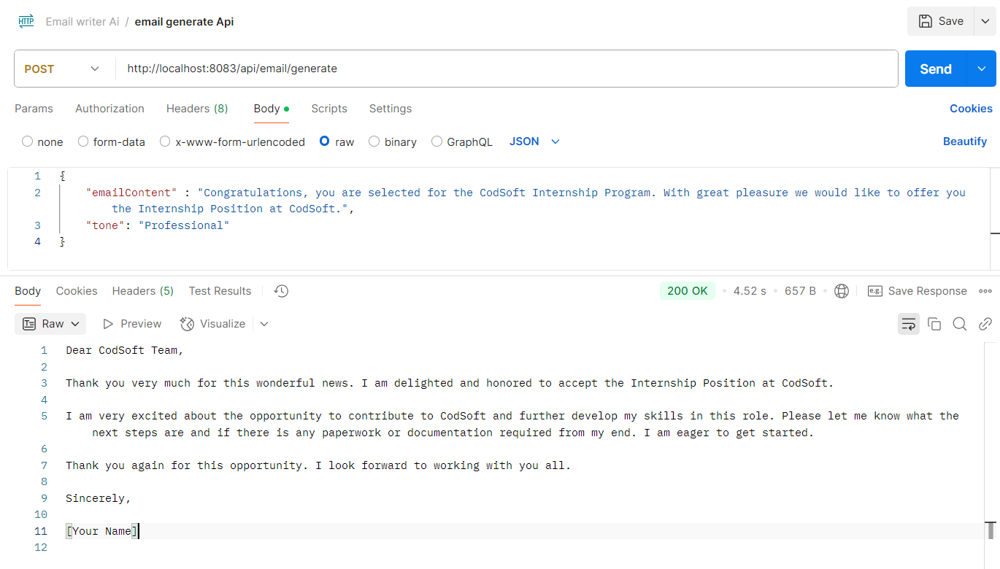

# 📧 Email Reply Writer AI - Backend

This is the Spring Boot backend for the **Email Reply Writer AI** Chrome Extension. It uses **Gemini AI** to generate smart, context-aware, and professionally toned email replies based on input content.

## 🔗 API Endpoint

**POST** `http://localhost:8083/api/email/generate`

### 📝 Request Body (JSON)

```json
{
  "emailContent": "Congratulations, you are selected for the CodSoft Internship Program. With great pleasure we would like to offer you the Internship Position at CodSoft.",
  "tone": "Professional"
}
```

### ✅ Sample Response

```json
Dear CodSoft Team,

Thank you very much for this wonderful news. I am delighted and honored to accept the Internship Position at CodSoft. 

I am very excited about the opportunity to contribute to CodSoft and further develop my skills in this role. Please let me know what the next steps are and if there is any paperwork or documentation required from my end. I am eager to get started.

Thank you again for this opportunity. I look forward to working with you all.

Sincerely,

[Your Name]
```

## 📸 Screenshot



## 🛠️ Tech Stack

- Java 17+
- Spring Boot
- WebClient (Reactive HTTP Client)
- Gemini AI API
- Maven

## 🔐 Environment Variables

Add the following to `application.properties`:

```properties
gemini.api.url=https://generativelanguage.googleapis.com/v1beta/models/gemini-pro:generateContent?key=
gemini.api.key=YOUR_API_KEY
```

## 🚀 Getting Started

1. Clone the repository:

```bash
git clone https://github.com/raj121276thakre/Email-reply-writer-ai-Backend.git
cd Email-reply-writer-ai-Backend
```

2. Configure your Gemini API key in `application.properties`.

3. Run the Spring Boot application:

```bash
mvn spring-boot:run
```

4. Test the API using Postman or integrate it with the frontend Chrome Extension.

## 🧠 Prompt Strategy

The backend builds a smart prompt for Gemini AI using:
- The original email content
- The selected tone (e.g., Professional, Friendly)

## 📁 Project Structure

```
├── controller/
├── model/
├── service/
├── resources/
│   └── application.properties
```

⭐ Feel free to star this repo if you found it helpful!
